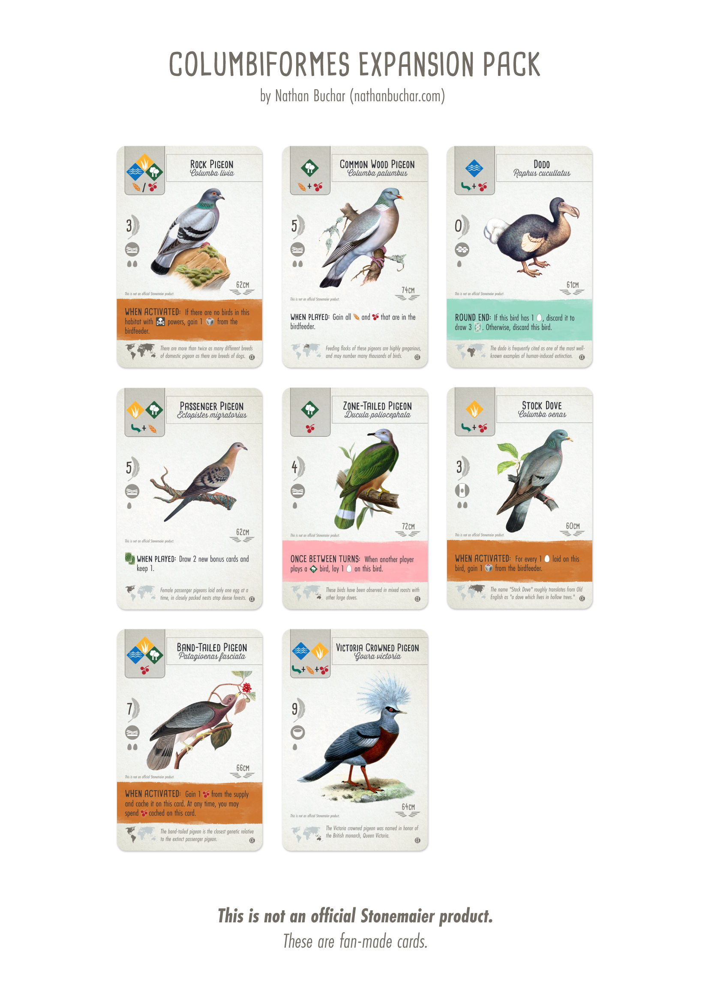

# Wingspan Columbiformes Expansion Pack

This is an unofficial expansion pack for [Wingspan](https://stonemaiergames.com/games/wingspan), a wonderfully nerdy and birdy boardgame designed by Elizabeth Hargrave and produced by Stonemaier Games. This expansion pack consists of the humble rock pigeon and seven of its columbiform cousins. **This is not an official Stonemaier product.**

Go [here](https://nathanbuchar.com/wingspan-pigeons/) to read my blog post about these cards. Go [here](https://github.com/nathanbuchar/wingspan-columbiformes-expansion/releases) to download.

See also: [Wingspan Bird Card Development Kit](https://github.com/nathanbuchar/wingspan-bird-card-dev-kit) (unofficial).

 

  

 
